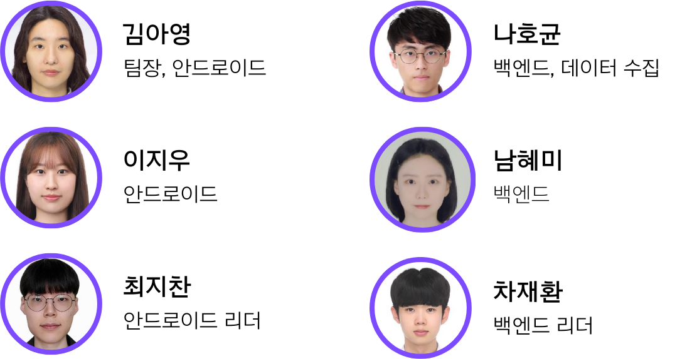

# 위키

# 🐥TOGEDUCK **- 생일 카페 올인원 플랫폼**

<p align="center">
    
</p>


## **TOGEDUCK 링크 : 앱스토어 링크 추후**

## **소개 영상 : UCC 링크 추후**

## 📅 프로젝트 기간

2024.01.08(월) ~ 2024.02.16(금) (40일간 진행)

SSAFY 10기 2학기 공통 프로젝트 : TOGEDUCK

## 🌐 TOGEDUCK 배경

좋아하는 연예인이 있는 당신! 생일 카페 문화를 방문한 경험이 있으신가요?

생일 카페를 알아보고 방문하고 기록하는 과정 속에서 겪은 불편함은 없으셨나요?

`‘TOGEDUCK’` 을 통해서 생일 카페를 더 간단하게 즐겨보세요!

## 📄 **TOGEDUCK 개요**

> TOGETHER + DUCK
> 

TOGEDUCK 을 통해서 내 최애 아이돌의 생일 카페 정보를 지도로 한눈에 확인할 수 있습니다.

아이돌 별로 생일 카페 이벤트를 관리할 수 있기 때문에 다양한 아이돌들을 관심 등록할 수 있습니다. 최애 아이돌이 여러명일 경우에도 걱정하지 않아도 됩니다.

투어 시작과 종료를 통해서 내가 방문했던 경로와 카페들을 기록할 수 있습니다. 과거에 방문했던 생일 카페를 알아보기 위해 따로 작성하지 말고 기록해보세요.

투어 과정 중에는 나의 위치가 익명으로 실시간 공유됩니다. 얼마나 많은 사람들이 함께 생일 카페를 즐기고 있는지 확인할 수 있습니다. 

카페를 방문하고 나서는 채팅을 통해 다양한 사람들과 설레는 감정을 나눠보세요. 

채팅뿐만 아니라 자체 제작 굿즈를 나눔하고, 교환하고 싶었던 해당 아이돌 굿즈를 거래해보고, 더 이상 혼자가 싫다면 함께 할 사람을 구할 수도 있습니다.

이제는 더이상 나 혼자 즐기는 하루가 아닌 모두와 함께 즐기는 시간을 체험할 수 있습니다.

## **💎 주요 기능**

---

- 연예인
    - 본명/활동명/그룹명을 통해 자신의 최애 연예인을 설정할 수 있습니다.
    - 생일 카페 정보를 확인할 연예인을 선택 후 진행할 수 있습니다.
- 지도
    - 지도를 통해 자신의 위치를 확인할 수 있습니다.
    - 지도를 통해 실시간으로 생일 카페의 위치를 확인할 수 있습니다.
    - 실시간 정보를 on/off 를 통해서 현재 투어중인 사용자들의 위치와 인원수를 확인할 수 있습니다.
- 생일 카페
    - 현재/과거/미래에 따른 생일 카페의 정보를 확인할 수 있습니다.
    - 각각의 카페를 즐겨찾기 하여 확인할 수 있습니다.
- 투어
    - 생일카페 투어 기능을 제공합니다.
    - 시작버튼을 눌러 트래킹을 시작하며 투어중일때 근처 카페의 방문처리를 할 수 있습니다.
    - 종료버튼을 눌러 투어를 종료할 수 있으며 방문 기록을 지도로 확인할 수 있습니다.
- 퀘스트
    - 4가지(잡담/교환/나눔/모집)로 나뉘는 퀘스트를 각각의 목적에 따라 사용할 수 있습니다.
    - 잡담 : 생일 카페 별 간단한 후기를 확인할 수 있습니다.
    - 교환 : 게시글을 올린 후 교환 요청을 걸어 수락/거절을 통해 교환을 진행할 수 있습니다.
    - 나눔 :  게시글을 올려 현재 나눔중인 물품을 알릴 수 있습니다.
    - 모집 : 다음으로 갈 생일 카페를 선택하여 같이 갈 인원을 모집할 수 있습니다.

## ✅ **주요 기술**

---

**Backend**

- Springboot 3.2.2
- Spring Data JPA
- Spring Security
- Spring Validation
- Spring Web
- QueryDSL
- WebSocket
- Redis
- MariaDB
- Firebase Cloud Messaging

**Android**

- Kotlin - 1.12.0
- MVVM
- ViewBinding
- MDC

**Infra**

- S3
- AWS EC2
- JENKINS
- NGINX
- SSL
- Docker


## ✅ **라이브러리**

---

**Android**

- Gms:play-services-location - 21.0.1
- Navigation - 2.7.6
- Hilt - 2.48
- Glide - 4.16.0
- Okhttp3 - 4.12.0
- Retrofit2 - 2.9.0
- Kotlinx-serialization - 1.6.0
- Preferences Datastore - 1.0.0
- Tedpermission - 3.3.0
- Tedclustering - 1.0.2
- StompProtocolAndroid - 1.6.6
- Rxjava - 2.2.5
- Rxandroid- 2.1.0
- Work manager - 2.9.0
- Tbuonomo dotsindicator - 5.0


## ✅ **프로젝트 파일 구조**

---

### **Frontend**

```
📦Android
 ┣ 📂.idea
 ┣ 📂TogeDuck
 ┃ ┣ 📂.idea
 ┃ ┣ 📂app
 ┃ ┃ ┣ 📂src
 ┃ ┃ ┃ ┣ 📂androidTest
 ┃ ┃ ┃ ┃ ┗ 📂java
 ┃ ┃ ┃ ┃ ┃ ┗ 📂com
 ┃ ┃ ┃ ┃ ┃ ┃ ┗ 📂idle
 ┃ ┃ ┃ ┃ ┃ ┃ ┃ ┗ 📂togeduck
 ┃ ┃ ┃ ┣ 📂main
 ┃ ┃ ┃ ┃ ┣ 📂java
 ┃ ┃ ┃ ┃ ┃ ┗ 📂com
 ┃ ┃ ┃ ┃ ┃ ┃ ┗ 📂idle
 ┃ ┃ ┃ ┃ ┃ ┃ ┃ ┗ 📂togeduck
 ┃ ┃ ┃ ┃ ┃ ┃ ┃ ┃ ┣ 📂di
 ┃ ┃ ┃ ┃ ┃ ┃ ┃ ┃ ┣ 📂model
 ┃ ┃ ┃ ┃ ┃ ┃ ┃ ┃ ┣ 📂util
 ┃ ┃ ┃ ┃ ┃ ┃ ┃ ┃ ┣ 📂view
 ┃ ┃ ┃ ┃ ┃ ┃ ┃ ┃ ┃ ┣ 📂favorite_setting
 ┃ ┃ ┃ ┃ ┃ ┃ ┃ ┃ ┗ 📂viewmodel
 ┃ ┃ ┃ ┃ ┣ 📂res
 ┃ ┃ ┃ ┃ ┃ ┣ 📂drawable
 ┃ ┃ ┃ ┃ ┃ ┣ 📂layout
 ┃ ┃ ┃ ┃ ┃ ┣ 📂mipmap-anydpi-v26
 ┃ ┃ ┃ ┃ ┃ ┣ 📂mipmap-hdpi
 ┃ ┃ ┃ ┃ ┃ ┣ 📂mipmap-mdpi
 ┃ ┃ ┃ ┃ ┃ ┣ 📂mipmap-xhdpi
 ┃ ┃ ┃ ┃ ┃ ┣ 📂mipmap-xxhdpi
 ┃ ┃ ┃ ┃ ┃ ┣ 📂mipmap-xxxhdpi
 ┃ ┃ ┃ ┃ ┃ ┣ 📂navigation
 ┃ ┃ ┃ ┃ ┃ ┣ 📂values
 ┃ ┃ ┃ ┃ ┃ ┣ 📂values-night
 ┃ ┃ ┃ ┃ ┃ ┗ 📂xml
 ┃ ┃ ┃ ┗ 📂test
 ┃ ┃ ┃ ┃ ┗ 📂java
 ┃ ┃ ┃ ┃ ┃ ┗ 📂com
 ┃ ┃ ┃ ┃ ┃ ┃ ┗ 📂idle
 ┗ ┃ ┃ ┃ ┃ ┃ ┃ ┗ 📂togeduck
   ┗ 📂gradle
     ┗ 📂wrapper

```

### **Backend**

```
📦togeduck
 ┣ 📂domain
 ┃ ┣ 📂celebrity
 ┃ ┃ ┣ 📂controller
 ┃ ┃ ┣ 📂dto
 ┃ ┃ ┣ 📂entity
 ┃ ┃ ┣ 📂repository
 ┃ ┃ ┗ 📂service
 ┃ ┣ 📂chat
 ┃ ┃ ┣ 📂controller
 ┃ ┃ ┣ 📂dto
 ┃ ┃ ┣ 📂entity
 ┃ ┃ ┣ 📂repository
 ┃ ┃ ┗ 📂servic
 ┃ ┣ 📂event
 ┃ ┃ ┣ 📂config
 ┃ ┃ ┣ 📂controller
 ┃ ┃ ┣ 📂dto
 ┃ ┃ ┣ 📂entity
 ┃ ┃ ┣ 📂repository
 ┃ ┃ ┗ 📂service
 ┃ ┣ 📂user
 ┃ ┃ ┣ 📂controller
 ┃ ┃ ┣ 📂dto
 ┃ ┃ ┣ 📂entity
 ┃ ┃ ┣ 📂feign
 ┃ ┃ ┃ ┗ 📂google
 ┃ ┃ ┣ 📂jwt
 ┃ ┃ ┣ 📂repository
 ┃ ┃ ┣ 📂serivce
 ┃ ┃ ┗ 📂util
 ┗ 📂global
   ┣ 📂config
   ┣ 📂handler
   ┣ 📂interceptor
   ┣ 📂response
   ┗ 📂util
```

## ✅ **협업 툴**

---

- Gitlab
    - 코드 버전 관리
    - 이슈 발행, 해결을 위한 토론
    - MR시, 팀원이 코드리뷰를 진행하고 피드백 게시
- 데일리 스크럼
    - 매일 아침 데일리 스크럼 진행, 전날 목표 달성량과 당일 할 업무 브리핑
    - 각자 위치에서 건네야 할 말이 생기면 팀원의 위치로 이동하여 전달
    - 빠른 소통과 신속한 대응 가능
- JIRA
    - 매주 목표량을 설정하여 Sprint 진행
    - 업무의 할당량을 정하여 Story Point를 설정하고, In-Progress -> Done 순으로 작업
    - 소멸 차트를 통해 프로젝트 진행도 확인
- Notion
    - 회의가 있을때마다 회의록을 기록하여 보관
    - 회의가 길어지지 않도록 다음날 제시할 안건을 미리 기록
    - 기술확보 시, 다른 팀원들도 추후 따라할 수 있도록 보기 쉽게 작업 순서대로 정리
    - 컨벤션 정리
    - 간트차트 관리
    - 스토리보드, 스퀀스다이어그램, 기능명세서 등 모두가 공유해야 하는 문서 관리
- Mattermost
    - 현재 작업 상황 공유
    - 실시간 정보 공유
    - GIt MR 알림
- Figma
    - 목업 제작, 와이어프레임제작, 디자인 작업 공유
- Adobe Illustrator
    - 프론트엔드 페이지 형태 상세 구성 제작
- Webex

## ✅ **팀원 역할 분배**

---

<p align="center">
    
</p>


## ✅ **프로젝트 산출물**

---
    
- [**요구사항 명세서**](./docs/요구사항명세서.md)
    
- [**API 명세서**](./docs/API명세서.md)

- [**디자인&컨셉기획**](https://www.notion.so/7a7894714d804835afdded38eb62d03e?pvs=21)

- [**시스템구성도**](./docs/시스템구성도.md)

- [**와이어프레임**](./docs/와이어프레임.md)
    
- [**목업**](./docs/목업.md)

- [**ERD**](./docs/ERD.md)
    
- [**JIRA**](./docs/JIRA.md)

    

---

## ✅ **프로젝트 결과물**

- 포팅메뉴얼
- 중간발표자료
- 최종발표자료

## 📱 **TOGEDUCK 서비스 화면**

---

### 스플래쉬 화면

- 앱 처음 실행 시 
로딩 하는동안 뜨는 스플래쉬 화면

<p align="center">
    
</p>

### 관심 연예인 검색 화면

<p align="center">
    
</p>


<p align="center">
    
</p>


<p align="center">
    
</p>

### 생일카페 이벤트 화면

- 이벤트 정보

<p align="center">
    
</p>
    
<p align="center">
    
</p>

<p align="center">
    
</p>

<p align="center">
    
</p>

### 투어화면

- 투어 시작
    - 실시간 이동 반영
    - 생일 카페 방문 기록
- 투어 종료
    - 이동 경로 저장

### 채팅 화면

- 채팅

### 나눔 화면

- 나눔 글 확인

<p align="center">
    
</p>

<p align="center">
    
</p>

### 교환 화면

- 교환 굿즈 등록

<p align="center">
    
</p>

- 교환 신청

- 교환 거래 또는 수락

<p align="center">
    
</p>

- 교환 채팅

<p align="center">
    
</p>

### 모집 화면

- 모집 글 작성

<p align="center">
    
</p>

- 모집 신청

<p align="center">
    
</p>

<p align="center">
    
</p>

### FCM 알림

- 교환 수락, 거절 시 알림

<p align="center">
    
</p>
