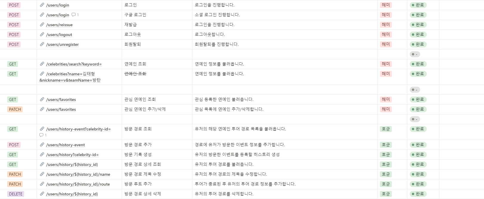
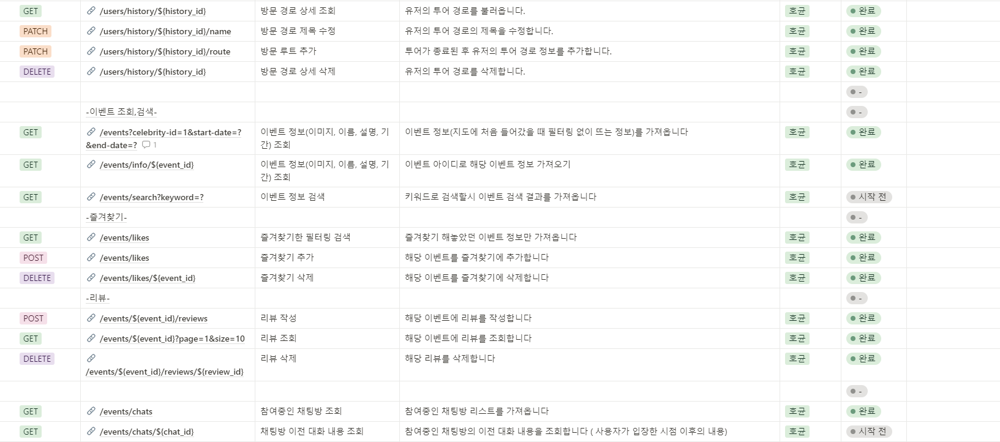
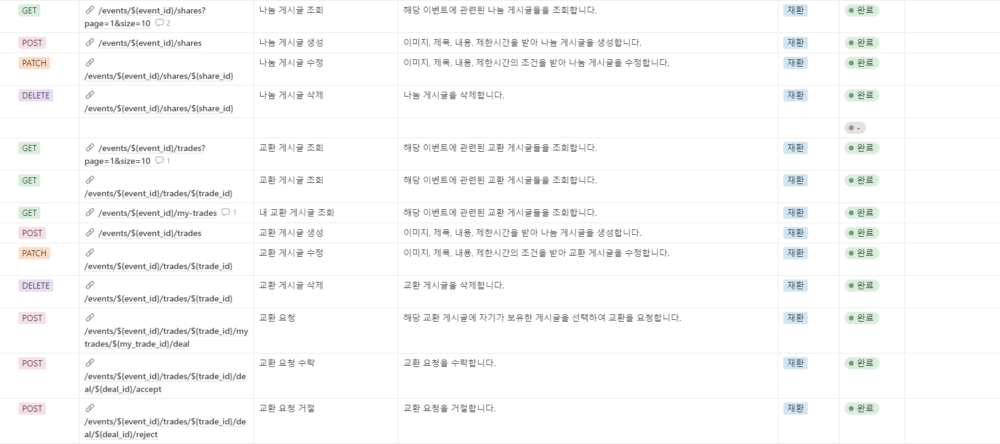
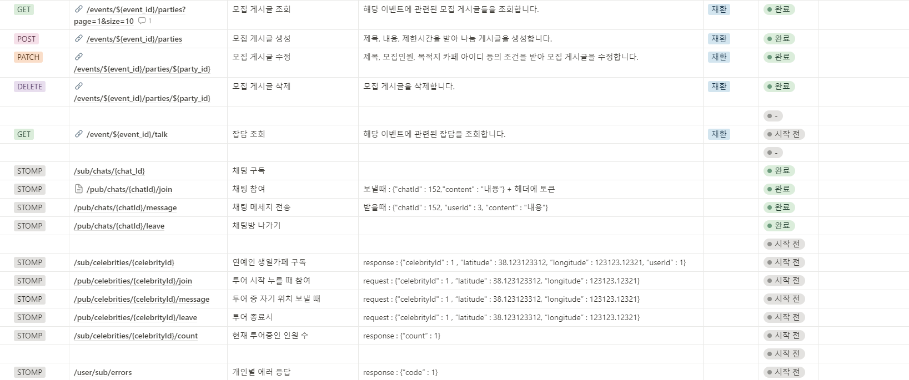

# API 명세서

## Notion 보기 : [Link](https://www.notion.so/7fc8586400724899bdca039a4bf5215b?v=d8a81cb5aaa0488da4ae9d6b8ebae279)

## Swagger UI : [Link](https://i10a301.p.ssafy.io/swagger-ui/index.html) 











## 상세 페이지
### Request

**Header**

| 이름 | 내용 | 필수 |
| --- | --- | --- |
| Authorization | Bearer {JWT_TOKEN} | O |

**Body(or Query Parameter)**

| 이름 | 타입 | 설명 |
| --- | --- | --- |
| keyword | String | 검색어 |

### Response

**Header**

| 이름 | 내용 |
| --- | --- |
|  |  |

**Body**

| 이름 | 타입 | 설명 |
| --- | --- | --- |
| status | Integer | HTTP 상태 코드 |
| message | String | 메세지 |
| id | Int | 연예인 ID |
| image | VARCAHR(100) | 연예인 이미지 |
| name | String | 연예인 이름 |
| birthday | DATE | 연예인 생일 |
| nickname | VARCAHR(100) | 연예인 활동명 |
| teamName | String | 팀 이름 |

---

### Example

**Request**

```json

```

**Response**

```json
{
    "code": 200,
    "message": "success",
    "data": [
        {
            "id": 1,
            "name": "김태형",
            "nickname": "뷔",
            "birthday": "1991-01-01",
            "image": null,
            "teamName": "방탄소년단"
        },
        {
            "id": 2,
            "name": "전정국",
            "nickname": "정국",
            "birthday": "1992-12-12",
            "image": null,
            "teamName": "방탄소년단"
        },
					...
    ]
}
```
