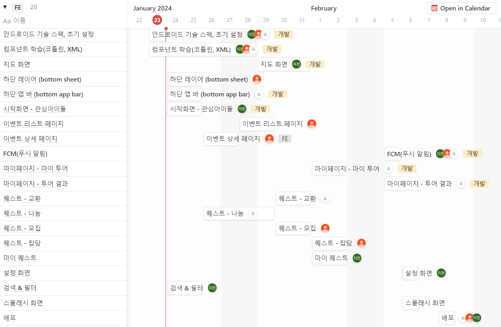

<240115 학습내용>
1. 와이어프레임 제작

---

<240116 학습내용>
1. 프로젝트 아이디어 회의
2. 지라 스프린트 입력

---

<240117 학습내용>
1. 프로젝트 아이디어 구체화
2. 목업 제작

---

<240118 학습내용>
1. 요구사항 명세서 작성
2. 일정표 작성

---

<240119 학습내용>
1. 아이디어 구체화
2. 화면 설계 회의
3. 요구사항 명세서 수정

---

<240122 학습내용>
1. Jira 작성
2. 안드로이드 학습

---

<240123 학습내용>
1. 요구사항 명세서 수정
2. 일정표 수정

---

<240124 학습내용>
1. 안드로이드 프로젝트 세팅
2. bottom sheet 개발
